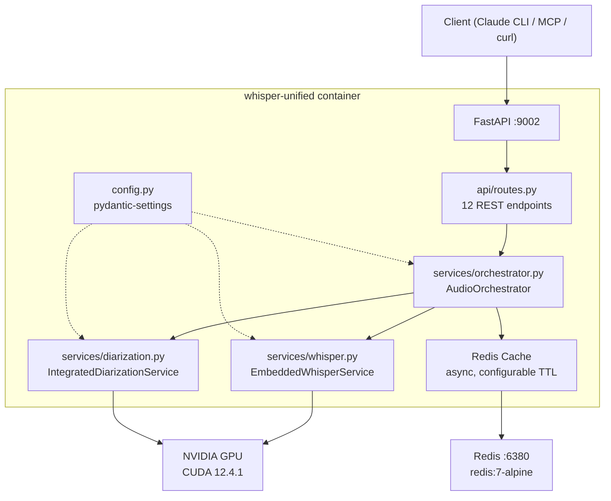

# CLAUDE.md

This file provides guidance to Claude Code (claude.ai/code) when working with code in this repository.

## Project Overview

whisper-unified — Unified STT (Speech-to-Text) service combining embedded faster-whisper transcription, PyAnnote speaker diarization, and Redis caching into a single GPU-accelerated container.

**Core Technologies:**
- Python 3.10 (pinned — NVIDIA CUDA 12.4.1 + Ubuntu 22.04)
- FastAPI + Uvicorn (async API server)
- faster-whisper (CTranslate2-based STT)
- PyAnnote Audio 3.3.1 (speaker diarization)
- Redis (async caching via redis.asyncio)
- NVIDIA CUDA 12.4.1 (GPU acceleration)
- PDM for dependency management

## Development Commands

### Setup
```bash
PDM_IGNORE_ACTIVE_VENV=1 pdm install -G ml -G test -G lint -G dev
PDM_IGNORE_ACTIVE_VENV=1 pdm run pre-commit install
PDM_IGNORE_ACTIVE_VENV=1 pdm run pre-commit install --hook-type commit-msg
```

### Testing
```bash
pdm run pytest                      # Run all tests (mocked ML)
pdm run pytest --cov=src            # With coverage
pdm run pytest tests/path -k "name" # Single test
pdm run pytest -v                   # Verbose output
```

### Linting & Type Checking
```bash
pdm run ruff check src/             # Linting
pdm run black --check src/ tests/   # Formatting check
pdm run isort --check src/ tests/   # Import sorting check
pdm run mypy src/                   # Type checking
pdm run bandit -r src/ -c pyproject.toml  # Security check

# Auto-fix
pdm run ruff check src/ --fix
pdm run black src/ tests/
pdm run isort src/ tests/
```

### Running
```bash
# Via Docker (production — requires NVIDIA GPU)
docker compose up -d

# Local development (requires CUDA + models)
pdm run python -m src.whisper_unified

# Export requirements for Docker build
pdm run export-requirements
```

## Architecture



### Core Components

| Module | Responsibility |
|--------|---------------|
| `src/whisper_unified/config.py` | pydantic-settings `Settings` class — all env var configuration |
| `src/whisper_unified/services/whisper.py` | `EmbeddedWhisperService` — faster-whisper model loading and transcription |
| `src/whisper_unified/services/diarization.py` | `IntegratedDiarizationService` — PyAnnote speaker diarization pipeline |
| `src/whisper_unified/services/orchestrator.py` | `AudioOrchestrator` — coordinates STT, diarization, cache, uploads |
| `src/whisper_unified/api/app.py` | FastAPI app factory, lifespan (model loading), CORS middleware |
| `src/whisper_unified/api/routes.py` | 12 API endpoints (OpenAI-compatible STT, diarization, uploads) |

### API Endpoints

| Method | Path | Purpose |
|--------|------|---------|
| GET | `/health` | Service health + dependency status |
| GET | `/` | Service info |
| GET | `/v1` | Available models list |
| POST | `/v1/audio/transcriptions` | OpenAI-compatible STT |
| POST | `/v1/audio/transcriptions/enhanced` | STT + speaker diarization |
| POST | `/v1/audio/language-detection` | Detect audio language |
| POST | `/v1/audio/speaker-diarization` | Diarization only |
| GET | `/v1/audio/uploads` | List uploaded files |
| POST | `/v1/audio/uploads` | Upload audio file |
| POST | `/v1/audio/start-transcription` | Process uploaded file |
| GET | `/v1/audio/uploads/{file_id}` | Get upload info |
| DELETE | `/v1/audio/uploads/{file_id}` | Delete uploaded file |

## Configuration

Configuration via environment variables (`.env` file). See `.env.example` for all options.

Key variables:
- `WHISPER_MODEL_NAME` — STT model (default: `Systran/faster-whisper-medium`)
- `WHISPER_COMPUTE_TYPE` — `float16` (GPU) or `int8` (CPU)
- `ENABLE_SPEAKER_DIARIZATION` — enable PyAnnote
- `HUGGINGFACE_TOKEN` — required for PyAnnote gated models
- `REDIS_URL` — Redis connection string
- `PORT` — service port (default: 9002)

## Important Patterns & Conventions

### Dependency Groups
- **Core deps**: fastapi, uvicorn, redis, structlog, pydantic-settings (lightweight)
- **ML group** (`-G ml`): torch, pyannote, faster-whisper (heavy, GPU — skip in CI tests)
- **Test group** (`-G test`): pytest with mocked ML imports
- CI runs lint + tests WITHOUT ml group (no 2GB+ torch download)

### Docker Strategy
- PDM for development; `pdm export` generates `requirements.txt` for Docker build
- Docker uses pip (not PDM) — simpler, proven, smaller image
- `orchestrator.py` in root = thin wrapper for backwards compatibility

### Testing
- All ML models (torch, PyAnnote, faster-whisper) are MOCKED in tests
- Tests run without GPU, without models, without Redis
- Use `TestClient` from FastAPI for endpoint testing

### Code Style
- Black formatter (line length 100)
- Ruff linter (E, W, F, I, B, C4, UP, ARG, SIM)
- isort (profile: black)
- Type hints on public functions
- Max 500 lines per file

## Semantic Versioning

- Uses python-semantic-release for automatic versioning
- Commit format: `type(scope): message`
  - `feat:` -> minor version bump
  - `fix:`, `perf:` -> patch version bump
- Version in `pyproject.toml:project.version`
- Changelog in `CHANGELOG.md`

## Common Pitfalls

1. **Python 3.10 ONLY** — pinned by CUDA image, do NOT use 3.11+ syntax (match/case, `X | Y` union types in annotations)
2. **PyAnnote requires HF_TOKEN** — without it, diarization falls back to fake mock segments
3. **torch CUDA index** — PDM uses `[[tool.pdm.source]]` with `https://download.pytorch.org/whl/cu124`
4. **Host networking** — docker-compose uses `network_mode: host` (WireGuard VPN DNS issues)
5. **Redis port 6380** — non-standard port to avoid conflicts with other Redis instances
6. **Model download on first start** — ~2GB for faster-whisper-medium, cached in `./models/`

## Adding New Features

1. Create module in `src/whisper_unified/`
2. Add tests in `tests/` (with mocked ML dependencies)
3. Update this CLAUDE.md if adding major components
4. Run `pdm run pre-commit run --all-files` before committing
