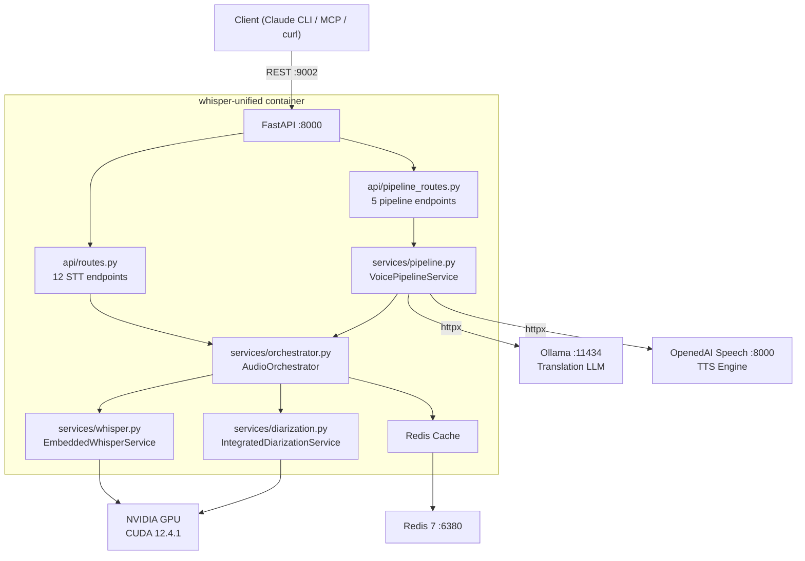
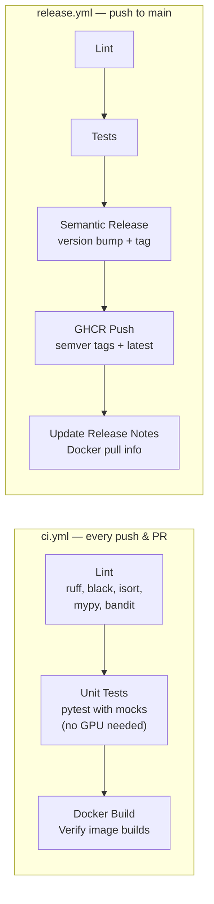

# Whisper Unified

Unified Speech-to-Text service combining **faster-whisper** (embedded STT model), **PyAnnote** (speaker diarization), **Redis** (result caching), and a **Voice Pipeline** (audio/video translation, subtitle generation, TTS) into a single GPU-accelerated container. Replaces the previous multi-container setup (`whisper` + `whisper-orchestrator` + `voice-pipeline`).

## Features

- **Embedded STT** — faster-whisper (CTranslate2) runs as a Python library, no external service calls
- **Speaker Diarization** — PyAnnote Audio 3.3.1 identifies who speaks when
- **Language Detection** — automatic language identification (Polish, English, auto)
- **Redis Caching** — configurable TTL caching for transcription results
- **OpenAI-compatible API** — drop-in replacement for `/v1/audio/transcriptions`
- **File Upload Management** — upload, list, process, and delete audio files
- **Voice Pipeline** — audio/video translation via Ollama + TTS, subtitle generation, voice cloning
- **GPU Acceleration** — NVIDIA CUDA 12.4.1 for fast inference

## Architecture



## Quick Start

### Prerequisites

- NVIDIA GPU with CUDA support
- Docker + Docker Compose
- [NVIDIA Container Toolkit](https://docs.nvidia.com/datacenter/cloud-native/container-toolkit/)
- HuggingFace token (for PyAnnote diarization models)

### Run with Docker (pull from GHCR)

```bash
cp .env.example .env
# Edit .env — set HUGGINGFACE_TOKEN

docker compose up -d
curl http://localhost:9002/health
```

### Run with Docker (local build)

```bash
docker compose -f docker-compose.yaml -f docker-compose.dev.yaml up --build -d
```

This uses the dev overlay which builds from local `Dockerfile` instead of pulling from GHCR,
mounts `src/` for live code changes, and sets `LOG_LEVEL=DEBUG`.

## Development Setup

### Prerequisites

- Python 3.10 (pinned — matches CUDA container)
- [PDM](https://pdm-project.org/) package manager (`pipx install pdm`)

### Install Dependencies

```bash
# Full install (with ML dependencies — requires CUDA)
PDM_IGNORE_ACTIVE_VENV=1 pdm install -G ml -G test -G lint -G dev

# Lightweight install (for linting/testing with mocks — no GPU needed)
PDM_IGNORE_ACTIVE_VENV=1 pdm install -G test -G lint -G dev
```

### Install Pre-commit Hooks

```bash
PDM_IGNORE_ACTIVE_VENV=1 pdm run pre-commit install
PDM_IGNORE_ACTIVE_VENV=1 pdm run pre-commit install --hook-type commit-msg
```

## Development Commands

| Command | Description |
|---------|-------------|
| `pdm run pytest` | Run all tests (mocked ML models) |
| `pdm run pytest --cov=src` | Run tests with coverage report |
| `pdm run ruff check src/` | Run linter |
| `pdm run ruff check src/ --fix` | Auto-fix lint issues |
| `pdm run black src/ tests/` | Format code |
| `pdm run isort src/ tests/` | Sort imports |
| `pdm run mypy src/` | Type checking |
| `pdm run bandit -r src/ -c pyproject.toml` | Security scan |
| `pdm run export-requirements` | Export requirements.txt for Docker |
| `pdm run start` | Run service locally (requires GPU) |

## API Endpoints

| Method | Path | Description | Request Format |
|--------|------|-------------|----------------|
| GET | `/health` | Service health + dependencies (Redis, GPU, model) | — |
| GET | `/` | Service info | — |
| GET | `/v1` | Available models list | — |
| POST | `/v1/audio/transcriptions` | OpenAI-compatible STT | multipart: file, model, language, response_format |
| POST | `/v1/audio/transcriptions/enhanced` | STT + speaker diarization | multipart: file, language, enable_speaker_diarization, max_speakers |
| POST | `/v1/audio/language-detection` | Detect audio language | multipart: file |
| POST | `/v1/audio/speaker-diarization` | Speaker diarization only | multipart: file, max_speakers |
| GET | `/v1/audio/uploads` | List uploaded files | — |
| POST | `/v1/audio/uploads` | Upload audio file (no auto-processing) | multipart: file |
| POST | `/v1/audio/start-transcription` | Process an uploaded file | form: file_id, language, enable_speaker_diarization |
| GET | `/v1/audio/uploads/{file_id}` | Get upload info | — |
| DELETE | `/v1/audio/uploads/{file_id}` | Delete uploaded file | — |
| POST | `/v1/audio/translate` | Translate audio (STT → LLM → TTS) | multipart: file, source_lang, target_lang |
| POST | `/v1/video/translate` | Translate video (extract → STT → LLM → TTS → merge) | multipart: file, source_lang, target_lang |
| POST | `/v1/subtitles/generate` | Generate SRT subtitles | multipart: file, source_lang, target_lang |
| POST | `/v1/voice/learn` | Extract voice sample from audio | multipart: file, start, end |
| POST | `/v1/voice/synthesize` | Text-to-speech synthesis | JSON: text, language, voice |

### Usage Examples

```bash
# Basic transcription
curl -X POST http://localhost:9002/v1/audio/transcriptions \
  -F "file=@recording.wav" -F "language=en"

# Transcription with speaker diarization
curl -X POST http://localhost:9002/v1/audio/transcriptions/enhanced \
  -F "file=@meeting.wav" -F "language=auto" \
  -F "enable_speaker_diarization=true" -F "max_speakers=4"

# Language detection
curl -X POST http://localhost:9002/v1/audio/language-detection \
  -F "file=@unknown.wav"

# Speaker diarization only
curl -X POST http://localhost:9002/v1/audio/speaker-diarization \
  -F "file=@conversation.wav"

# Translate audio (English → Polish)
curl -X POST http://localhost:9002/v1/audio/translate \
  -F "file=@recording.wav" -F "source_lang=en" -F "target_lang=pl"

# Generate subtitles
curl -X POST http://localhost:9002/v1/subtitles/generate \
  -F "file=@video.mp4" -F "source_lang=auto"

# Text-to-speech
curl -X POST http://localhost:9002/v1/voice/synthesize \
  -H "Content-Type: application/json" \
  -d '{"text": "Cześć świecie", "language": "pl", "voice": "alloy"}'
```

## Configuration

Configuration via environment variables. Copy `.env.example` to `.env` and adjust:

```bash
cp .env.example .env
```

| Variable | Default | Description |
|----------|---------|-------------|
| `PORT` | `9002` | Host port (internal: 8000) |
| `WHISPER_MODEL_NAME` | `Systran/faster-whisper-medium` | STT model (small/medium/large-v3) |
| `WHISPER_LANGUAGE` | `auto` | Default language |
| `WHISPER_COMPUTE_TYPE` | `float16` | Precision: `float16` (GPU) or `int8` (CPU) |
| `CUDA_VISIBLE_DEVICES` | `0` | GPU device ID |
| `ENABLE_SPEAKER_DIARIZATION` | `true` | Enable PyAnnote diarization |
| `PYANNOTE_MODEL` | `pyannote/speaker-diarization-3.1` | Diarization model |
| `HUGGINGFACE_TOKEN` | — | HuggingFace token (required for PyAnnote) |
| `REDIS_URL` | `redis://localhost:6380` | Redis connection string |
| `ENABLE_CACHING` | `true` | Enable Redis caching |
| `CACHE_TTL` | `3600` | Cache TTL in seconds |
| `LANGUAGE_DETECTION` | `true` | Enable language detection |
| `WHISPER_SUPPORTED_LANGUAGES` | `pl,en,auto` | Supported languages |
| `WHISPER_AUTO_TRANSCRIPTION` | `false` | Auto-transcribe on upload |
| `WHISPER_UPLOAD_ONLY_MODE` | `true` | Upload-only mode (manual start) |
| `WHISPER_DEFAULT_DIARIZATION` | `true` | Enable diarization by default |
| `ENABLE_VOICE_PIPELINE` | `true` | Enable translation/TTS/subtitles pipeline |
| `OLLAMA_URL` | `http://localhost:11434` | Ollama server for text translation |
| `OLLAMA_MODEL` | `llama3.2:1b` | LLM model for translation |
| `TTS_URL` | `http://localhost:8000` | OpenedAI Speech TTS server |
| `TTS_ENGINE` | `piper` | TTS engine name |
| `TTS_VOICE` | `alloy` | TTS voice name |
| `WORKSPACE` | `/workspace` | Output directory for pipeline files |
| `MAX_CONCURRENT_JOBS` | `2` | Max concurrent pipeline jobs |
| `JOB_TIMEOUT` | `600` | Pipeline job timeout in seconds |

## CI/CD Pipeline

Two GitHub Actions workflows:



**CI** (`ci.yml`) — runs on every push and pull request:
- **Lint job**: Python 3.10, checks code quality and security
- **Test job**: Runs unit tests with mocked ML dependencies (no torch/GPU download)
- **Docker job**: Builds the Docker image to verify it compiles
- **PR Labels** (`pr-labels.yml`): auto-labels PRs by size, file paths, and syncs label definitions

**Release** (`release.yml`) — runs on push to `main`, skips non-code changes (`paths-ignore`):
- Runs lint + tests, then `python-semantic-release` for version bump
- Publishes Docker image to GHCR with semver tags: `0.2.1`, `0.2`, `0`, `latest`
- Registry: `ghcr.io/jacekzubielik/whisper-unified`

## Hardware Requirements

| Resource | Minimum | Recommended |
|----------|---------|-------------|
| GPU | NVIDIA with CUDA 12.4+ | RTX 3050 Ti or better |
| VRAM | 2 GB (medium model) | 4 GB+ (large-v3) |
| RAM | 4 GB | 8 GB |
| Disk | 5 GB (models + cache) | 10 GB |

## Port Mapping

| Port | Service |
|------|---------|
| 9002 | Whisper Unified API (host) → 8000 (container) |
| 6380 | Redis (host networking, non-standard to avoid conflicts) |

## License

MIT
